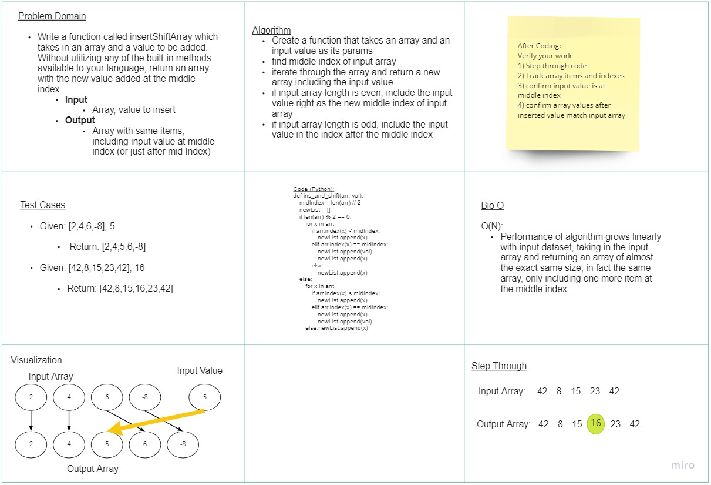

# Insert and Shift and Array at Middle Index
Write a function called insertShiftArray which takes in an array and a value to be added. Without utilizing any of the built-in methods available to your language, return an array with the new value added at the middle index.

## Whiteboard Process
<!-- Embedded whiteboard image -->


## Approach & Efficiency
<!-- What approach did you take? Discuss Why. What is the Big O space/time for this approach? -->
- Big O:
  - O(N)
    - As the size of the input increases, as does the function workload
- Code tested in Replit (including print()'s):
  - [Replit - Arr-Ins-Shift](https://replit.com/@MarcoSimplician/StudiousIrritatingSystemcall#main.py)
- The code I want to depict in this process is as follows:

```python
def ins_and_shift(arr, val):
  midIndex = len(arr) // 2
  newList = []
  if len(arr) % 2 == 0:
    for x in arr:
      if arr.index(x) < midIndex:
        newList.append(x)
      elif arr.index(x) == midIndex:
        newList.append(val)
        newList.append(x)
      else:
        newList.append(x)
  else:
    for x in arr:
      if arr.index(x) < midIndex:
        newList.append(x)
      elif arr.index(x) == midIndex:
        newList.append(x)
        newList.append(val)
      else:
        newList.append(x)
```