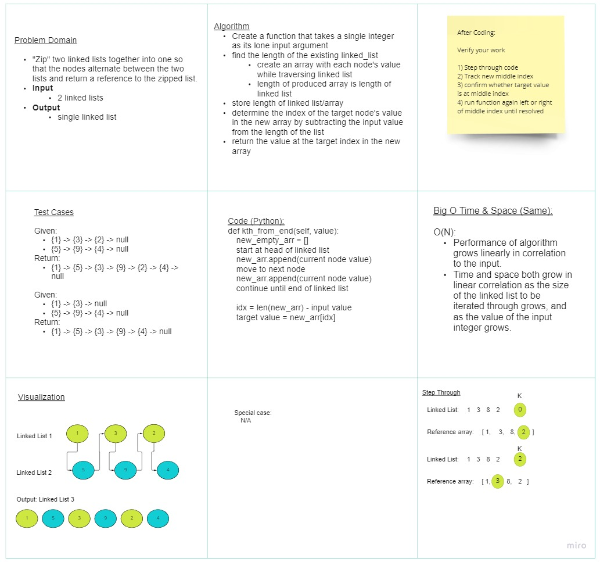

# Linked List Zip

Write the following method for the Linked List class:

Linked List Zip
Zip together linked lists...
<hr>

## Whiteboard Process
<!-- Embedded whiteboard image -->


## Approach & Efficiency
<!-- What approach did you take? Discuss Why. What is the Big O space/time for this approach? -->
- The algorithm I want to depict in this process is as follows:

```
def kth_from_end(self, value):
 new_empty_arr = []
 start at head of linked list
 new_arr.append(current node value)
 move to next node
 new_arr.append(current node value)
 continue until end of linked list

 idx = len(new_arr) - input value
 target value = new_arr[idx]
```
