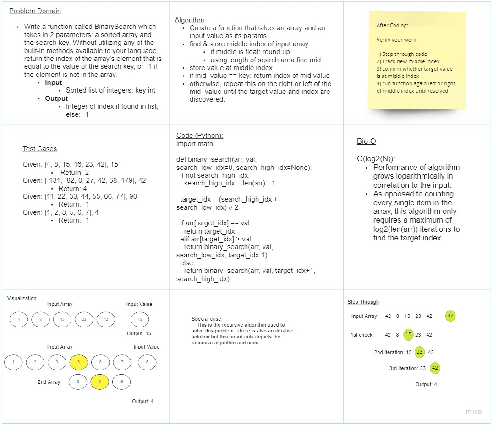

# Binary Search of Sorted Array
Write a function called BinarySearch which takes in 2 parameters: a sorted array and the search key. Without utilizing any of the built-in methods available to your language, return the index of the array’s element that is equal to the value of the search key, or -1 if the element is not in the array.
## Whiteboard Process
<!-- Embedded whiteboard image -->


## Approach & Efficiency
<!-- What approach did you take? Discuss Why. What is the Big O space/time for this approach? -->
- Big O:
  - O(N)
    - As the size of the input increases, as does the function workload

<hr>
  - The code I used to solve this problem was inspired by code I found on `stackoverflow.com`.

  - [Code on StackOverflow](https://stackoverflow.com/questions/19989910/recursion-binary-search-in-python)
<hr>

- My code tested in Replit (including print()'s):
  - [Replit - Arr-Binary-Search](https://replit.com/@MarcoSimplician/ForkedKnowledgeableQuarks#main.py)
- My code:

```python
import math

def binary_search(arr, val, search_low_idx=0, search_high_idx=None):
  if not search_high_idx:
    search_high_idx = len(arr) - 1

  target_idx = (search_high_idx + search_low_idx) // 2
 
  if arr[target_idx] == val:
    return target_idx
  elif arr[target_idx] > val:
    return binary_search(arr, val, search_low_idx, target_idx-1)
  else:
    return binary_search(arr, val, target_idx+1, search_high_idx)
```