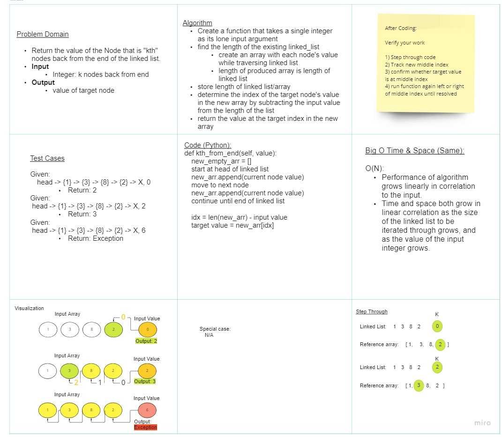

# Kth From End

Write the following method for the Linked List class:

kth from end
argument: a number, k, as a parameter.
Return the node’s value that is k places from the tail of the linked list.
You have access to the Node class and all the properties on the Linked List class as well as the methods created in previous challenges.
<hr>

## Whiteboard Process
<!-- Embedded whiteboard image -->


## Approach & Efficiency
<!-- What approach did you take? Discuss Why. What is the Big O space/time for this approach? -->
- The algorithm I want to depict in this process is as follows:

```
def kth_from_end(self, value):
 new_empty_arr = []
 start at head of linked list
 new_arr.append(current node value)
 move to next node
 new_arr.append(current node value)
 continue until end of linked list

 idx = len(new_arr) - input value
 target value = new_arr[idx]
```
